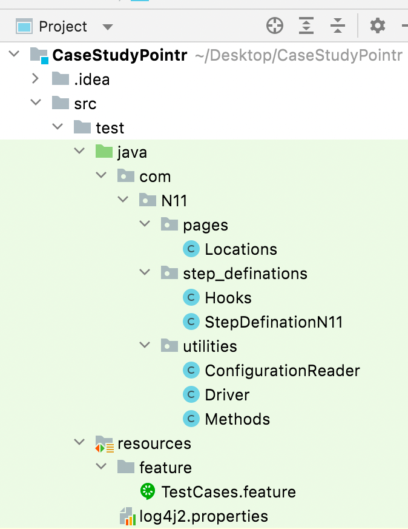
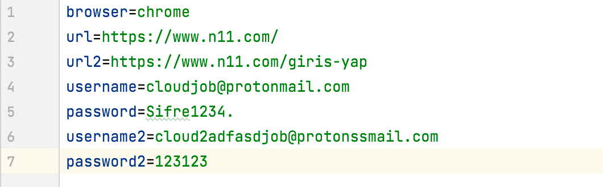
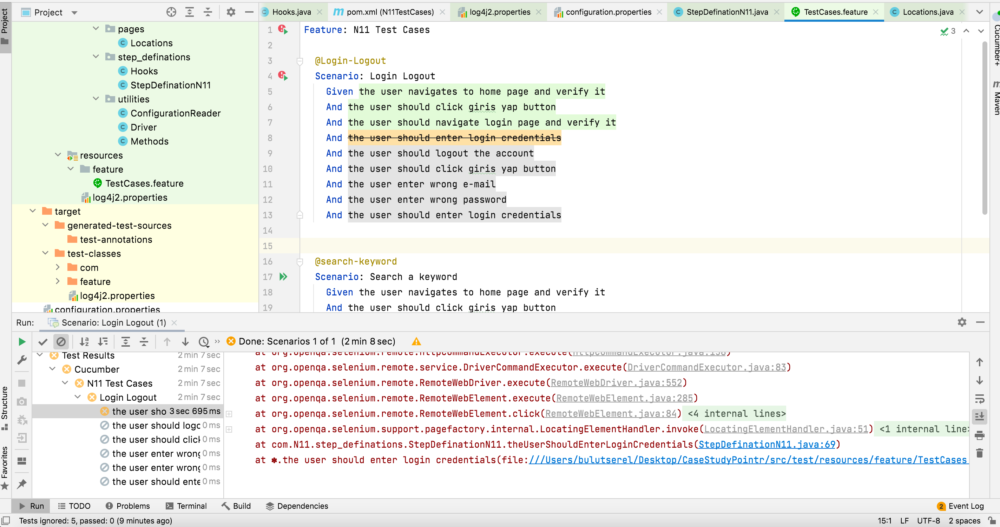
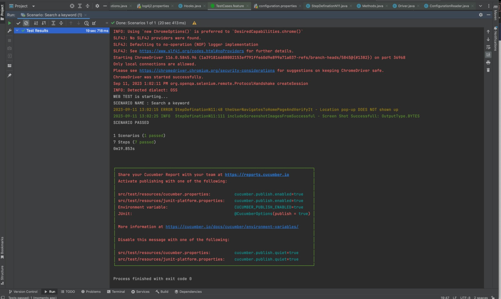

## Pointr Case Study

---
## This framework contains sample code containing:
Codes are written by BDD format.
Test cases are written by Gherkin format.

1. Pages 
2. Step Definations 
3. Utilities
4. Feature -> TestCases.feature
5. Configuration

---
## Structure

---

## Scenario's
**Scenario: Login Logout**

**Given** the user navigates to home page and verify it

**And** the user should click giris yap button

**And** the user should navigate login page and verify it

**And** the user should enter login credentials

**And** the user should logout the account

**And** the user should click giris yap button

**And** the user enter wrong e-mail

**And** the user enter wrong password

**And** the user should enter login credentials

---

**Scenario: Search a keyword**

**Given** the user navigates to home page and verify it

**And** the user should click giris yap button

**And** the user should navigate login page and verify it

**And** the user should enter login credentials

**And** the user should search keyword

**And** the user display the search results in Browser

**And** Include screenshot images from successful

## Parameterize test data

## See configuration in "pom.xml" file

            <plugin>
                <groupId>org.apache.maven.plugins</groupId>
                <artifactId>maven-surefire-plugin</artifactId>
                <version>2.22.2</version>
                <configuration>
                    <parallel>methods</parallel>
                    <useUnlimitedThreads>true</useUnlimitedThreads>
                    <testFailureIgnore>true</testFailureIgnore>
                    <runOrder>Alphabetical</runOrder>
                    <includes>
                        <include>**/*CukesRunner.java</include>
                        <include>**/*FailedTestRunner.java</include>
                    </includes>
                </configuration>
            </plugin>

## Possible Error

N11 website catch us when we try to login many times. If website catch us 
we will get an error like below:

**We can fix the error by creating new user.
Additionally, this error not happens all time.**

## Success

